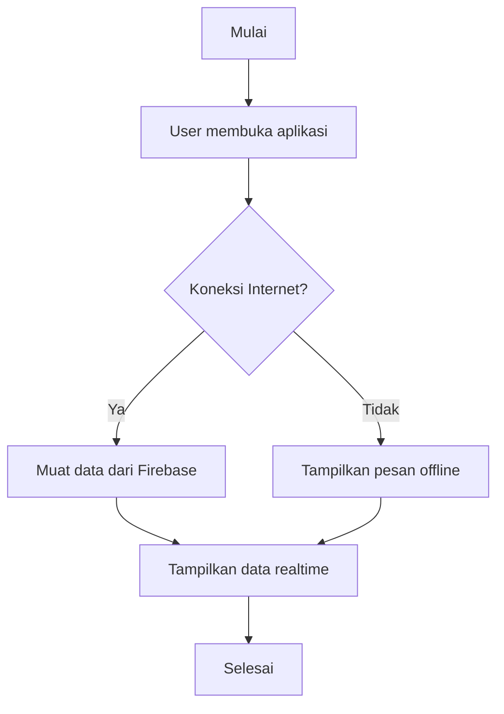

```mermaid
flowchart TD
    A[Mulai] --> B[User membuka aplikasi]
    B --> C{Koneksi Internet?}
    C -- Ya --> D[Muat data dari Firebase]
    C -- Tidak --> E[Tampilkan pesan offline]
    D --> F[Tampilkan data realtime]
    E --> F
    F --> G[Selesai]
```
