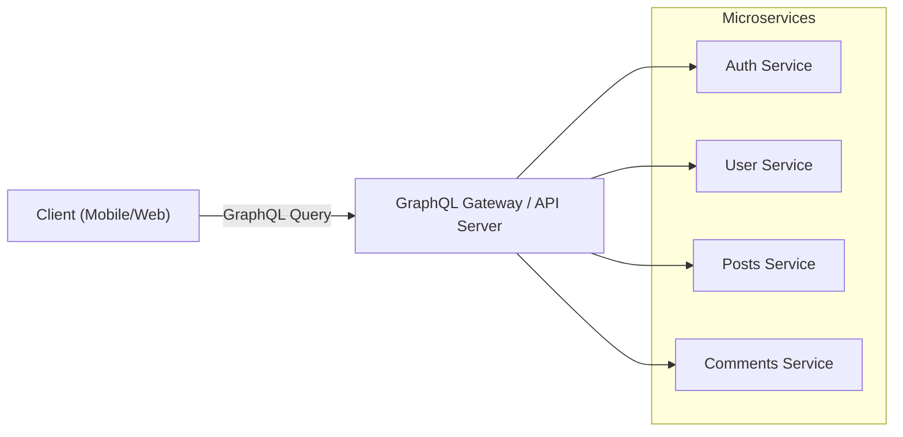

```mermaid
flowchart LR
    Client["Client (Mobile/Web)"]
    GQL["GraphQL Gateway / API Server"]

    subgraph Microservices
        Auth["Auth Service"]
        User["User Service"]
        Post["Posts Service"]
        Comment["Comments Service"]
    end

    Client -->|GraphQL Query| GQL
    GQL --> Auth
    GQL --> User
    GQL --> Post
    GQL --> Comment
```
